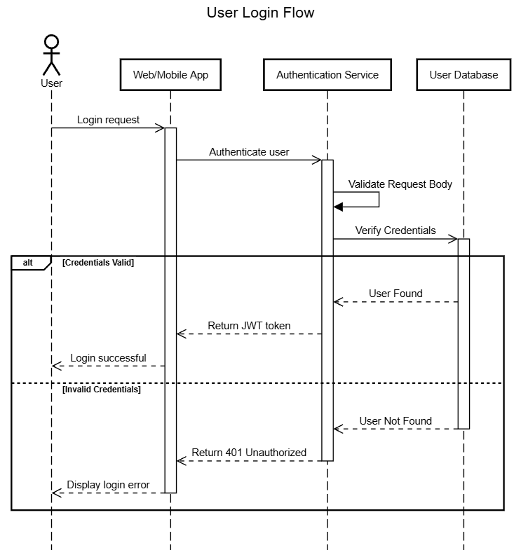
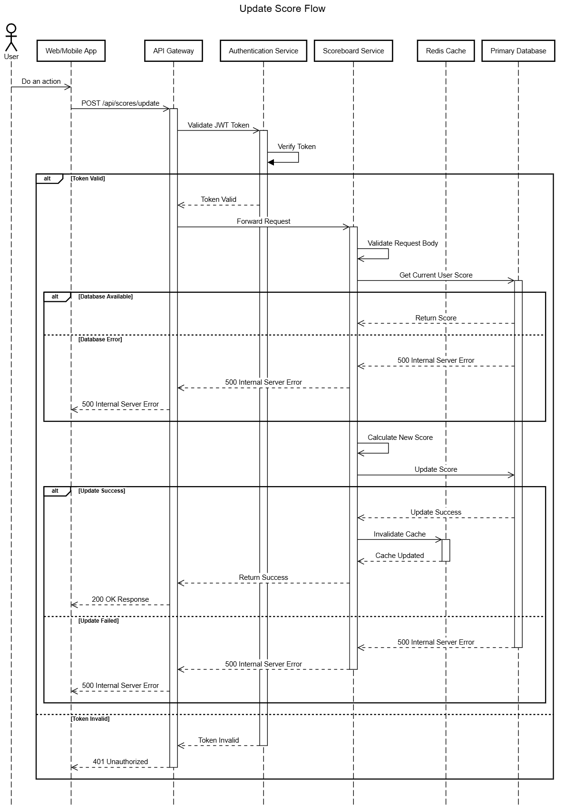
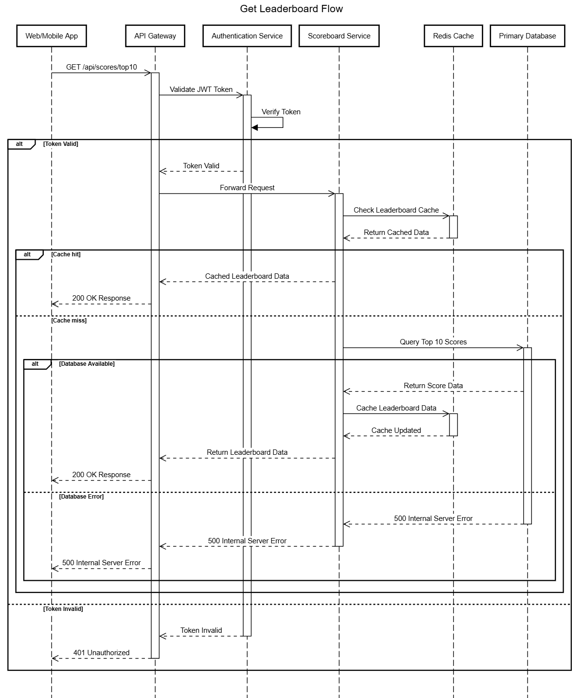

# Scoreboard API Documentation
This document describes the API specification for a scoreboard system, which maintains a leaderboard displaying the top 10 users with the highest scores. The system supports real-time updates and ensures security against unauthorized score manipulations.

## Authentication
All endpoints except login require JWT authentication. Include the token in the Authorization header:
```
Authorization: Bearer {token}
```

## API Endpoints

### 1. User Authentication
#### `POST /api/auth/login`
Authenticates a user and provides a JWT token for subsequent requests.

**Request Body:**
```json
{
  "username": "Alice",
  "password": "password123"
}
```

**Success Response (200 OK):**
```json
{
    "success": true,
    "data": {
		"token": "eyJhbGciOiJIUzI1NiIs...",
	    "expiresIn": 3600,
	}
}
```

**Error Responses:**
-   `400 Bad Request` if validation failure.
-   `401 Unauthorized` if credentials are incorrect.
-   `500 Internal Server Error` for unexpected authentication failures.

### 2. Top 10 Scores
#### `GET /api/scores/top10`
Returns the top 10 users with the highest scores.

**Query Parameters:**
- `timeframe` (optional): "daily" | "weekly" | "allTime" (default: "allTime")

**Success Response (200 OK):**
```json
{
  "success": true,
  "data": {
    "top10": [
      {
        "userId": 123,
        "username": "player1",
        "score": 1000,
        "rank": 1,
        "lastUpdated": "2024-02-21T10:30:00Z"
      }
    ],
    "timeframe": "allTime",
    "lastUpdated": "2024-02-21T10:30:00Z"
  }
}
```

**Error Responses:**
-   `400 Bad Request` if validation failure.
-   `401 Unauthorized` if credentials are incorrect.
-   `500 Internal Server Error` for unexpected authentication failures.

**Notes:**
-   The response should be **cached** to optimize performance.
-   Sorting should be done in **descending order** based on scores.

### 3. Score Update
#### `POST /api/scores/update`
Updates the score of a user after they complete an action.

**Request Body:**
```json
{
    "userId": 123,
    "scoreIncrement": 10,
    "actionType": "GAME_COMPLETION",
    "timestamp": "2024-02-21T10:30:00Z"
}
```

**Validation Rules:**
- scoreIncrement: must be a positive integer
- actionType: must be from predefined list
- timestamp: cannot be future date

**Success Response (200 OK):**
```json
{
    "success": true,
    "data": {
        "userId": 123,
        "newScore": 1010,
        "newRank": 5,
        "previousRank": 6
    }
}
```
**Error Responses:**
-   `400 Bad Request` if validation failure.
-   `401 Unauthorized` if authentication token is missing or invalid.
-   `403 Forbidden` if the user is attempting to modify another user's score.
-   `404 Not Found` if the `userId` does not exist.
-   `429 Too Many Requests` if the user exceeds rate limits.
-   `500 Internal Server Error` for unexpected issues.

## Error Handling
All endpoints follow consistent error response format:

```json
{
    "success": false,
    "error": {
        "code": "ERROR_CODE",
        "message": "Human readable message",
        "details": [
	        "Additional error context",
	    ],
        "timestamp": "2024-02-21T10:30:00Z"
    }
}
```

## Security Measures
1. Input Validation
   - All inputs are sanitized and validated
   - Strict type checking
   - Size limits on all fields

2. Authentication & Authorization
   - JWT with short expiration
   - Role-based access control
   - Token rotation

3. Monitoring & Logging
   - All authentication attempts logged
   - Score updates tracked
   - Suspicious patterns monitored

## System Architecture
### User Login API


### Score Update API


### Top 10 Scores API


## Future Improvements
-   Implement **WebSocket** for real-time leaderboard updates.
-   Store **historical score data** for analytics and trends.
-   Implement **OAuth-based authentication** for better security.